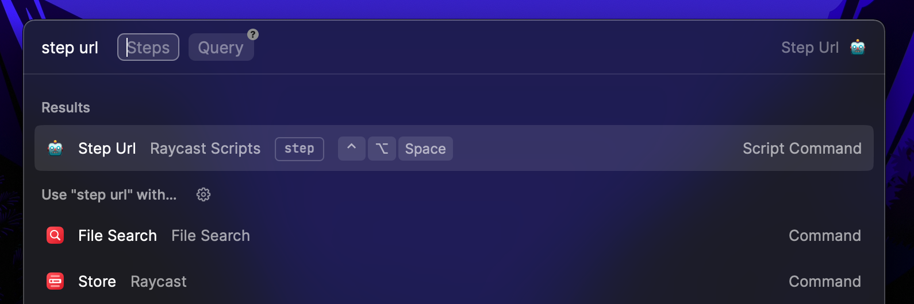

# 🤖 step-url

Script to fast open url with [raycast](https://www.raycast.com/) based on a registered steps routes

## How to use it

- Dowload the [`step-url.js`](dist/step-url.js) script and [`step-url.config.json`](dist/step-url.config.json) files and place them **on the same folder**
- Edit `step-url.config.json` to your needs adding nested steps

## Config File

The config file contains all the urls accesible for the script and different dividers or wildcards to search for

### Attributes

- `$configs`
  - `$dividers` -> Array of chars that may split the differents steps
  - `$wildcard` -> Wildcard to be replacefor for the provided query
  - `$comboWildcard` -> Wildcard to indicate the steps correspond to a combo
- `$combos` -> Steps resulting in an array of steped routes
  - `^[a-z0-9]+$` -> Step that is an array of route steps or an object
    - `_name` -> Name to be displayed when oppening the urls
    - `_routes` -> Array with the different routes to open
- `$routes` -> Steps resulting in an url to be opened
  - `^[a-z0-9]+$` -> Step that is an url string or an object
    - `_name` -> Name to be displayed when oppening the url
    - `_url` -> The url for that step
    - `_search` -> Url with the query wildcard to be replaced

> You may validate the config file with [`step-url.schema.json`](src/step-url.schema.json)
